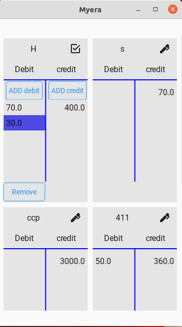
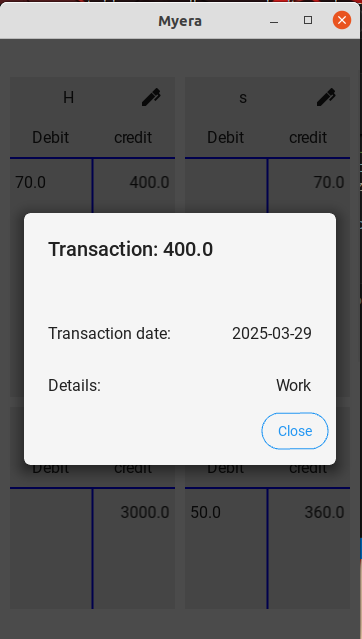
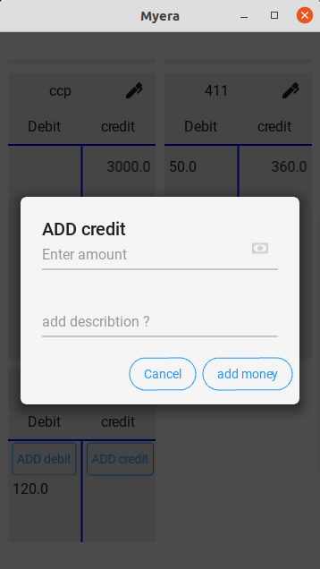

## **Money Transaction App** 🏦💰

This is a **KivyMD-based money transaction app** that allows users to manage their **debit and credit transactions** efficiently. The app is still in development, so you may encounter some incomplete features and missing functionalities.

### **Features** ✨
- 📌 **Add Debit and Credit Transactions**  
- ✏️ **Edit Mode** – Enables adding/removing transactions  
- 🛡️ **Delete Transactions** – Select and remove unwanted records  
- 📎 **Data Persistence** – Transactions are stored using CSV  
- 🎨 **Modern UI** – Built with KivyMD for a clean, mobile-friendly interface  

---

### **Screenshots** 📸




---

### **Installation & Usage** 🚀

#### **1. Clone the Repository**
```bash
git clone https://github.com/yourusername/money-transaction-app.git
cd money-transaction-app
```

#### **2. Install Dependencies**
Ensure you have Python and the required libraries installed. You can install dependencies using:
```bash
pip install kivy kivymd pandas
```

#### **3. Run the App**
```bash
python main.py
```

---

### **Development Status & Roadmap** 🛠️
This project is still a **work in progress**. Here’s what's planned:
- ✅ **Basic Debit & Credit Management**
- 🛠️ **Improve Transaction History View**
- ⏳ **Add Filtering and Sorting Features**
- 🔜 **Database Integration (SQLite)**
- 📱 **Convert to Mobile App (Android APK)**

---

### **Contributing** 🤝
Feel free to contribute! You can:
1. **Fork** the repo  
2. **Create a branch** (`feature-xyz`)  
3. **Submit a Pull Request**  

---

### **License** 📛
This project is **open-source** under the **MIT License**.

